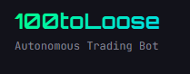

<div align="center">



# 100toLoose - Autonomous Trading Bot

**Bot de trading autónomo para criptomonedas con inteligencia artificial y análisis técnico avanzado**

[](https://fastapi.tiangolo.com/)
[](https://reactjs.org/)
[](https://www.typescriptlang.org/)
[](https://www.postgresql.org/)
[](https://www.docker.com/)

</div>

---

## 📋 Tabla de Contenidos

- [Características Principales](#-características-principales)
- [Stack Tecnológico](#-stack-tecnológico)
- [Instalación](#-instalación)
- [Configuración](#-configuración)
- [Uso](#-uso)
- [Estrategias Disponibles](#-estrategias-disponibles)
- [DeepSeek AI Integration](#-deepseek-ai-integration)
- [Arquitectura](#-arquitectura)
- [API Endpoints](#-api-endpoints)
- [Seguridad](#-seguridad)
- [Desarrollo](#-desarrollo)
- [Advertencia](#-advertencia)

---

## 🚀 Características Principales

### 🤖 Trading Autónomo
- **Operación 24/7**: Bot que monitorea y ejecuta trades automáticamente
- **WebSocket en Tiempo Real**: Datos de mercado actualizados cada ~100ms
- **Ejecución Instantánea**: Trades ejecutados inmediatamente al detectar señales
- **Monitoreo Continuo**: Stop Loss y Take Profit monitoreados en tiempo real

### 🧠 Inteligencia Artificial
- **DeepSeek AI Integration**: Análisis contextual avanzado con IA
- **Decisiones Inteligentes**: Recomendaciones basadas en contexto del mercado
- **Gestión de Riesgo IA**: Evaluación dinámica de riesgo por cada trade
- **Explicabilidad**: Razonamiento claro de cada decisión tomada

### 📊 Múltiples Estrategias
- **RSI (Relative Strength Index)**: Detección de sobrecompra/sobreventa
- **MACD**: Convergencia y divergencia de medias móviles
- **Bollinger Bands**: Bandas de volatilidad
- **EMA Cross**: Cruce de medias móviles exponenciales
- **Combined**: Combinación de múltiples indicadores
- **Scalping**: Estrategia agresiva para trading de alta frecuencia

### 💰 Modos de Trading
- **Paper Trading (Testnet)**: Trading simulado con Binance Testnet
- **Real Trading**: Trading real con Binance (configuración separada)
- **Sincronización Automática**: Balance sincronizado con Binance
- **Configuración Dual**: API keys separadas para Testnet y Real

### 📈 Dashboard Avanzado
- **Resumen por Estrategia**: Métricas individuales de cada estrategia activa
- **Estadísticas en Tiempo Real**: P&L, Win Rate, trades abiertos/cerrados
- **DeepSeek Decisions Log**: Historial de decisiones de IA
- **Gráficos Interactivos**: Visualización de precios y análisis técnico
- **Multi-idioma**: Soporte para Español e Inglés

### 🔔 Sistema de Notificaciones
- **Telegram Bot**: Notificaciones instantáneas de todos los trades
- **Email Summaries**: Resúmenes diarios con estadísticas
- **Configuración Flexible**: Activar/desactivar por tipo de notificación

### 📝 Sistema de Logs
- **Logs Estructurados**: Backend y frontend con rotación automática
- **Múltiples Categorías**: App, Trades, API, DeepSeek, Email, Telegram
- **Límite de Tamaño**: Archivos de máximo 5MB con historial corto
- **Interfaz de Visualización**: Panel de logs integrado en la aplicación

### ⚙️ Profile Manager
- **Configuración Completa**: Binance (Testnet/Real), DeepSeek, SMTP, Telegram
- **Gestión de Perfil**: Nombre, email de resúmenes, contacto
- **Validación y Tests**: Pruebas de configuración antes de guardar
- **Seguridad**: Contraseñas y tokens enmascarados

### 🌐 Infraestructura
- **NGINX Reverse Proxy**: Rate limiting, compresión, seguridad
- **Docker Compose**: Orquestación completa de servicios
- **PostgreSQL**: Base de datos robusta y escalable
- **Redis**: Cache para datos en tiempo real
- **PgAdmin**: Interfaz de administración de base de datos

---

## 🛠️ Stack Tecnológico

### Backend
- **FastAPI** (Python 3.11) - Framework web asíncrono
- **PostgreSQL 16** - Base de datos relacional
- **Redis** - Cache y mensajería
- **SQLAlchemy** (async) - ORM asíncrono
- **WebSockets** - Comunicación en tiempo real
- **Pydantic** - Validación de datos
- **Loguru** - Sistema de logging avanzado

### Frontend
- **React 18** + **TypeScript** - Framework UI
- **Vite** - Build tool y dev server
- **TailwindCSS** - Estilos utility-first
- **Lightweight Charts** - Gráficos de trading (TradingView)
- **Framer Motion** - Animaciones
- **Zustand** - Gestión de estado
- **Axios** - Cliente HTTP
- **i18n** - Internacionalización (ES/EN)

### Servicios Externos
- **Binance API** - Datos de mercado y ejecución de trades
- **DeepSeek API** - Análisis de IA
- **Telegram Bot API** - Notificaciones
- **SMTP** - Envío de emails

### Infraestructura
- **Docker** & **Docker Compose** - Contenedores
- **NGINX** - Reverse proxy y load balancer
- **PgAdmin 4** - Administración de PostgreSQL

---

## 📦 Instalación

### Requisitos Previos
- Docker Desktop o Docker Engine + Docker Compose
- Git
- Cuenta en Binance (opcional, para trading real)
- API Key de DeepSeek (opcional, para IA)

### 1. Clonar el Repositorio

```bash
git clone <repository-url>
cd 100toLoose
```

### 2. Configurar Variables de Entorno

Crear archivo `.env` en la raíz del proyecto:

```env
# Database
POSTGRES_USER=Folkencillo
POSTGRES_PASSWORD=7887Folkencillo!
POSTGRES_DB=100toloose-db

# PgAdmin
PGADMIN_DEFAULT_EMAIL=admin@100toloose.com
PGADMIN_DEFAULT_PASSWORD=7887Folkencillo!

# Backend
SECRET_KEY=tu-clave-secreta-cambiar-en-produccion
DATABASE_URL=postgresql://Folkencillo:7887Folkencillo!@db:5432/100toloose-db
REDIS_URL=redis://redis:6379

# Binance (opcional - solo para trading real)
BINANCE_API_KEY=tu-api-key
BINANCE_SECRET_KEY=tu-secret-key
BINANCE_TESTNET=true
```

### 3. Levantar los Servicios

```bash
docker-compose up --build
```

Esto iniciará todos los servicios:
- **Frontend** (React) en puerto 3000
- **Backend** (FastAPI) en puerto 8000
- **NGINX** (Reverse Proxy) en puerto 80
- **PostgreSQL** en puerto 5432
- **Redis** en puerto 6379
- **PgAdmin** en puerto 5050

### 4. Acceder a la Aplicación

- **Frontend**: http://localhost:3000
- **Backend API**: http://localhost:8000
- **API Docs (Swagger)**: http://localhost:8000/docs
- **NGINX (Frontend)**: http://localhost
- **PgAdmin**: http://localhost:5050

---

## ⚙️ Configuración

### Configuración Inicial

1. **Crear Cuenta**: Accede a http://localhost:3000 y crea tu cuenta
2. **Configurar Binance Testnet**:
   - Ve a Profile → Binance Testnet
   - Obtén tus API keys de [Binance Testnet](https://testnet.binance.vision/)
   - Configura API Key y Secret Key
3. **Configurar Telegram** (Opcional):
   - Crea un bot con [@BotFather](https://t.me/botfather)
   - Obtén el Chat ID usando `/getID` en tu bot
   - Configura en Profile → Telegram
4. **Configurar Email** (Opcional):
   - Configura SMTP (Gmail, Outlook, etc.)
   - Configura en Profile → SMTP
5. **Configurar DeepSeek AI** (Opcional):
   - Obtén tu API key de [DeepSeek](https://www.deepseek.com/)
   - Configura en Profile → DeepSeek
   - Activa el toggle para habilitar IA

### Modos de Trading

- **Paper Trading (Testnet)**: Modo por defecto, usa Binance Testnet
- **Real Trading**: Requiere API keys de Binance Real configuradas

**⚠️ IMPORTANTE**: El sistema usa configuraciones separadas:
- **Binance Testnet**: Para Paper Trading
- **Binance Real**: Para Real Trading

---

## 🎮 Uso

### 1. Dashboard

El dashboard muestra:
- **Balance Actual**: Sincronizado con Binance (si está configurado)
- **Estadísticas Generales**: Total trades, win rate, P&L
- **Resumen por Estrategia**: Métricas individuales de cada estrategia activa
- **Trades Recientes**: Últimos 5 trades ejecutados
- **DeepSeek Decisions**: Últimas decisiones de IA ejecutadas

### 2. Crear Estrategia

1. Ve a **Strategies**
2. Click en **"Create Strategy"**
3. Selecciona:
   - **Nombre** de la estrategia
   - **Tipo**: RSI, MACD, Bollinger, etc.
   - **Símbolos** a monitorear (ej: BTCUSDT, ETHUSDT)
   - **Max Trade Amount**: Cantidad máxima por trade
   - **Stop Loss %**: Porcentaje de pérdida máxima
   - **Take Profit %**: Porcentaje de ganancia objetivo
   - **Max Open Trades**: Máximo de trades abiertos simultáneos
4. Click en **"Create"**
5. **Activa** la estrategia con el toggle

### 3. Activar el Bot

1. Ve a **Strategies**
2. Verifica que al menos una estrategia esté **activa**
3. El bot comenzará a monitorear automáticamente
4. Los trades se ejecutarán cuando se detecten señales

### 4. Trading Manual

1. Ve a **Trading**
2. Selecciona un símbolo (ej: BTCUSDT)
3. Analiza los indicadores técnicos en el gráfico
4. Ejecuta compra/venta manual si lo deseas

### 5. Monitorear Logs

1. Ve a **Logs**
2. Selecciona el tipo de log:
   - **App**: Logs generales de la aplicación
   - **Trades**: Logs de ejecución de trades
   - **API**: Logs de llamadas a Binance
   - **DeepSeek**: Logs de decisiones de IA
   - **Email**: Logs de envío de emails
   - **Telegram**: Logs de notificaciones Telegram
3. Activa **Auto-refresh** para ver logs en tiempo real

---

## 📊 Estrategias Disponibles

| Estrategia | Descripción | Señal de Compra | Señal de Venta | Agresividad |
|------------|-------------|-----------------|----------------|-------------|
| **RSI** | Relative Strength Index | RSI < 30 (sobreventa) | RSI > 70 (sobrecompra) | Media |
| **MACD** | Moving Average Convergence Divergence | Histograma positivo + tendencia alcista | Histograma negativo + tendencia bajista | Media |
| **Bollinger** | Bandas de Bollinger | Precio toca banda inferior | Precio toca banda superior | Media |
| **EMA Cross** | Cruce de Medias Móviles | EMA9 cruza por encima de EMA21 | EMA9 cruza por debajo de EMA21 | Baja |
| **Combined** | Combinación de Indicadores | 2+ señales de compra simultáneas | 2+ señales de venta simultáneas | Alta |
| **Scalping** | Trading de Alta Frecuencia | RSI < 45 + MACD positivo | RSI > 55 + MACD negativo | Muy Alta |

Cada estrategia incluye tooltips informativos explicando su funcionamiento y ejemplos.

---

## 🧠 DeepSeek AI Integration

### ¿Qué es DeepSeek AI?

DeepSeek AI es una capa de análisis inteligente que complementa los indicadores técnicos tradicionales, proporcionando:

- **Análisis Contextual**: Entiende el contexto del mercado más allá de números
- **Gestión de Riesgo Inteligente**: Evalúa riesgo considerando múltiples factores
- **Recomendaciones Personalizadas**: Adapta decisiones según historial
- **Explicabilidad**: Proporciona razonamiento claro de cada decisión

### Cómo Funciona

```
Indicadores Técnicos + Contexto del Mercado
         ↓
    DeepSeek AI Analiza
         ↓
Recomendación + Confianza + Razonamiento + Gestión de Riesgo
         ↓
    Decisión Final del Bot
```

### Configuración

1. Obtén tu API Key de [DeepSeek](https://www.deepseek.com/)
2. Ve a **Profile → DeepSeek**
3. Ingresa tu API Key
4. Activa el toggle **"Enable DeepSeek AI"**
5. El bot consultará DeepSeek antes de ejecutar trades

### Decisiones de DeepSeek

- **BUY / STRONG_BUY**: Recomendación de compra
- **SELL / STRONG_SELL**: Recomendación de venta
- **HOLD**: Mantener posición actual
- **Confidence**: Nivel de confianza (0-100%)
- **Risk Assessment**: LOW, MEDIUM, HIGH

El bot solo ejecuta trades si:
- Confianza ≥ 70%
- Riesgo ≠ HIGH
- Recomendación coincide con señal técnica

---

## 🏗️ Arquitectura

### Diagrama de Componentes

```
┌─────────────────────────────────────────────────────────┐
│                     NGINX (Port 80)                     │
│              Reverse Proxy + Rate Limiting               │
└──────────────┬──────────────────────────┬───────────────┘
               │                          │
    ┌──────────▼──────────┐    ┌──────────▼──────────┐
    │   Frontend (React)  │    │  Backend (FastAPI) │
    │   Port 3000         │    │  Port 8000         │
    └─────────────────────┘    └──────────┬─────────┘
                                           │
                    ┌──────────────────────┼──────────────────────┐
                    │                      │                      │
         ┌──────────▼──────────┐  ┌───────▼──────┐  ┌───────────▼──────────┐
         │   PostgreSQL        │  │    Redis     │  │   Binance API        │
         │   Port 5432         │  │   Port 6379  │  │   (Testnet/Real)     │
         └─────────────────────┘  └─────────────┘  └──────────────────────┘
                    │
         ┌──────────▼──────────┐
         │   PgAdmin           │
         │   Port 5050         │
         └─────────────────────┘
```

### Flujo de Trading

```
1. WebSocket recibe precio de Binance
   ↓
2. Bot analiza indicadores técnicos
   ↓
3. Si hay señal técnica:
   ↓
4. (Opcional) Consulta DeepSeek AI
   ↓
5. Si DeepSeek aprueba (o no está activo):
   ↓
6. Ejecuta trade en Binance (Testnet/Real)
   ↓
7. Guarda trade en PostgreSQL
   ↓
8. Envía notificaciones (Telegram/Email)
   ↓
9. Monitorea Stop Loss / Take Profit
   ↓
10. Cierra trade cuando se alcanza SL/TP
```

### Estructura del Proyecto

```
100toLoose/
├── backend/
│   ├── app/
│   │   ├── api/v1/endpoints/    # Endpoints REST
│   │   ├── core/                 # Config, DB, Security
│   │   ├── models/               # Modelos SQLAlchemy
│   │   ├── schemas/              # Schemas Pydantic
│   │   ├── services/             # Lógica de negocio
│   │   │   ├── binance_service.py
│   │   │   ├── deepseek_service.py
│   │   │   ├── realtime_trading_bot.py
│   │   │   ├── websocket_manager.py
│   │   │   └── ...
│   │   └── main.py
│   ├── logs/                     # Archivos de log
│   ├── Dockerfile
│   └── requirements.txt
├── frontend/
│   ├── src/
│   │   ├── components/           # Componentes React
│   │   ├── pages/                # Páginas
│   │   ├── services/             # API client
│   │   ├── store/                # Estado (Zustand)
│   │   └── i18n/                 # Traducciones
│   ├── Dockerfile
│   └── package.json
├── nginx/
│   ├── Dockerfile
│   └── nginx.conf
├── docker-compose.yml
├── 110toloose.png
└── README.md
```

---

## 📡 API Endpoints

### Autenticación
- `POST /api/v1/auth/login` - Iniciar sesión
- `POST /api/v1/auth/register` - Registro (comentado en frontend)

### Usuario
- `GET /api/v1/users/me` - Usuario actual
- `GET /api/v1/users/dashboard` - Datos del dashboard
- `PUT /api/v1/users/trading-mode` - Cambiar modo de trading

### Trades
- `GET /api/v1/trades/` - Listar trades
- `POST /api/v1/trades/` - Crear trade manual
- `POST /api/v1/trades/{id}/close` - Cerrar trade

### Estrategias
- `GET /api/v1/strategies/` - Listar estrategias
- `GET /api/v1/strategies/with-status` - Estrategias con estado en tiempo real
- `POST /api/v1/strategies/` - Crear estrategia
- `PUT /api/v1/strategies/{id}` - Actualizar estrategia
- `POST /api/v1/strategies/{id}/activate` - Activar estrategia
- `POST /api/v1/strategies/{id}/deactivate` - Desactivar estrategia
- `DELETE /api/v1/strategies/{id}` - Eliminar estrategia

### Mercado
- `GET /api/v1/market/price/{symbol}` - Precio actual
- `GET /api/v1/market/klines/{symbol}` - Velas/OHLC
- `GET /api/v1/market/24hr-ticker/{symbol}` - Estadísticas 24h
- `GET /api/v1/market/analysis/{symbol}` - Análisis técnico
- `GET /api/v1/market/symbols` - Símbolos disponibles

### Bot
- `GET /api/v1/bot/status` - Estado del bot
- `GET /api/v1/bot/stats` - Estadísticas del bot
- `POST /api/v1/bot/start` - Iniciar bot
- `POST /api/v1/bot/stop` - Detener bot

### WebSocket
- `WS /api/v1/ws/prices` - Precios en tiempo real

### Perfil
- `GET /api/v1/profile/settings` - Obtener configuración
- `PUT /api/v1/profile/settings` - Actualizar configuración
- `POST /api/v1/profile/settings/test-email` - Probar email
- `POST /api/v1/profile/settings/test-telegram` - Probar Telegram
- `GET /api/v1/profile/settings/get-telegram-chat-id` - Obtener Chat ID

### DeepSeek
- `GET /api/v1/deepseek/decisions` - Listar decisiones de IA
- `GET /api/v1/deepseek/decisions/{id}` - Obtener decisión específica

### Logs
- `GET /api/v1/logs/` - Listar archivos de log
- `GET /api/v1/logs/view/{log_type}` - Ver log
- `GET /api/v1/logs/stats` - Estadísticas de logs

---

## 🔒 Seguridad

### Medidas Implementadas

- **Autenticación JWT**: Tokens seguros con expiración
- **Hashing de Contraseñas**: bcrypt con salt
- **CORS Configurado**: Orígenes permitidos controlados
- **Rate Limiting**: NGINX limita requests por IP
- **Validación de Datos**: Pydantic valida todos los inputs
- **Enmascaramiento de Secrets**: Contraseñas y tokens no se exponen
- **Paper Trading por Defecto**: Sin riesgo real hasta configurar

### Buenas Prácticas

- ⚠️ **NUNCA** compartas tus API keys
- ⚠️ **NUNCA** uses la misma contraseña en producción
- ⚠️ **SIEMPRE** usa Paper Trading para probar
- ⚠️ **VERIFICA** tus configuraciones antes de activar Real Trading
- ⚠️ **MONITOREA** tus logs regularmente

---

## 🔧 Desarrollo

### Comandos Útiles

```bash
# Ver logs en tiempo real
docker-compose logs -f backend
docker-compose logs -f frontend

# Reiniciar un servicio
docker-compose restart backend
docker-compose restart frontend

# Reconstruir servicios
docker-compose up --build

# Parar todos los servicios
docker-compose down

# Parar y eliminar volúmenes (⚠️ borra datos)
docker-compose down -v

# Acceder a la base de datos
docker exec -it 100toloose-db psql -U Folkencillo -d 100toloose-db

# Acceder al contenedor del backend
docker exec -it 100toloose-backend bash

# Acceder al contenedor del frontend
docker exec -it 100toloose-frontend sh
```

### Desarrollo Local

#### Backend

```bash
cd backend
python -m venv venv
source venv/bin/activate  # Windows: venv\Scripts\activate
pip install -r requirements.txt
uvicorn app.main:app --reload --host 0.0.0.0 --port 8000
```

#### Frontend

```bash
cd frontend
npm install
npm run dev
```

### Estructura de Logs

Los logs se almacenan en `backend/logs/`:
- `app.log` - Logs generales de la aplicación
- `error.log` - Solo errores
- `trades.log` - Logs de ejecución de trades
- `api.log` - Logs de llamadas a Binance
- `deepseek.log` - Logs de decisiones de IA
- `email.log` - Logs de envío de emails
- `telegram.log` - Logs de notificaciones Telegram

Cada archivo tiene un límite de 5MB y rota automáticamente.

---

## ⚠️ Advertencia

**ESTE SOFTWARE ES SOLO PARA FINES EDUCATIVOS Y DE INVESTIGACIÓN**

### Riesgos del Trading

- ⚠️ El trading de criptomonedas conlleva **riesgos significativos**
- ⚠️ Puedes **perder todo tu capital** en trading real
- ⚠️ Los resultados pasados **NO garantizan** resultados futuros
- ⚠️ **NO inviertas** dinero que no puedas permitirte perder
- ⚠️ **SIEMPRE** prueba primero con Paper Trading

### Limitaciones

- Este bot es una herramienta educativa
- No proporciona asesoramiento financiero
- No garantiza ganancias
- El trading algorítmico tiene riesgos inherentes
- Los mercados de criptomonedas son altamente volátiles

### Responsabilidad

El uso de este software es bajo tu propia responsabilidad. Los desarrolladores no se hacen responsables de pérdidas financieras derivadas del uso de este bot.

---

## 📄 Licencia

MIT License

---

## 🤝 Contribuciones

Las contribuciones son bienvenidas. Por favor:
1. Fork el proyecto
2. Crea una rama para tu feature (`git checkout -b feature/AmazingFeature`)
3. Commit tus cambios (`git commit -m 'Add some AmazingFeature'`)
4. Push a la rama (`git push origin feature/AmazingFeature`)
5. Abre un Pull Request

---

## 📧 Contacto

Para preguntas o soporte, abre un issue en el repositorio.

---

<div align="center">

**Hecho con ❤️ para la comunidad de trading**

⭐ Si te gusta este proyecto, dale una estrella ⭐

</div>
